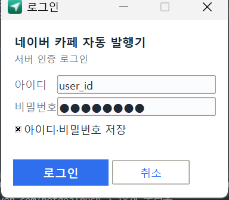
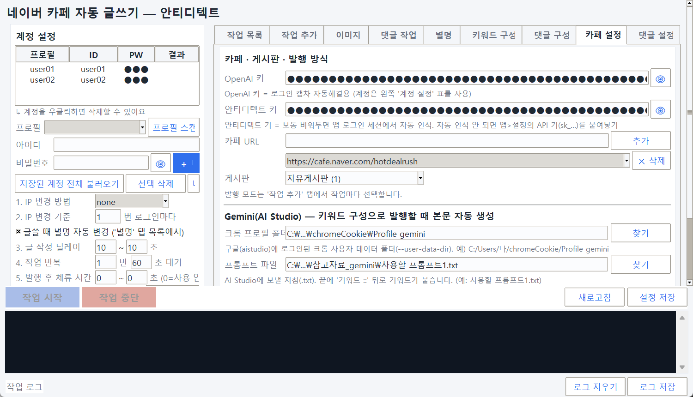
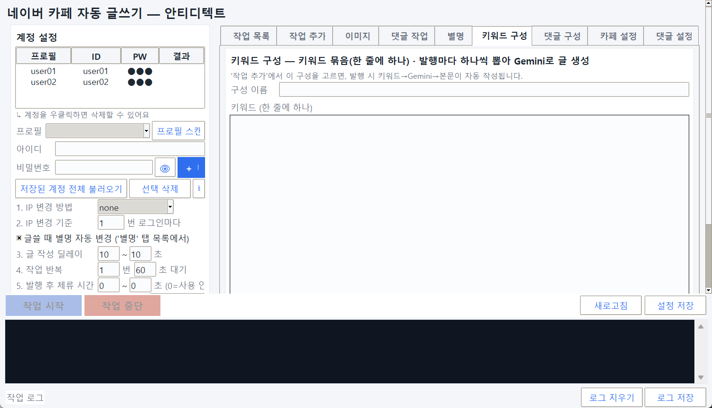
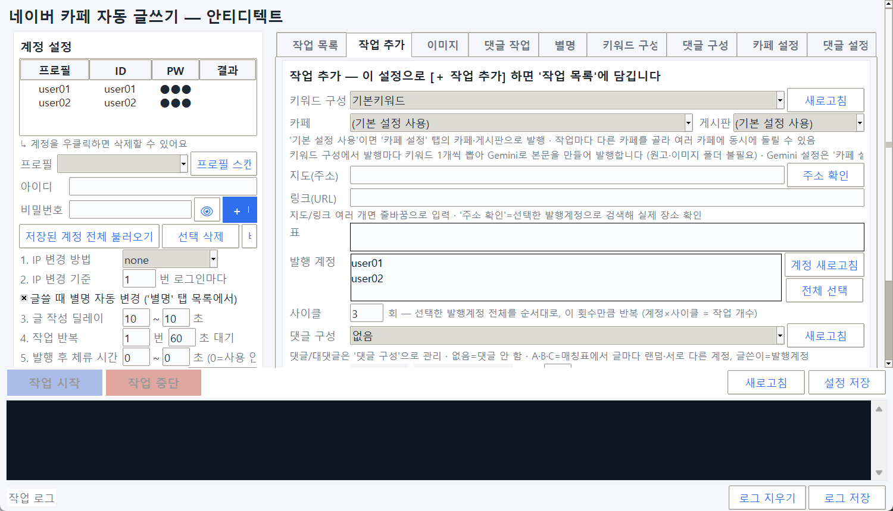
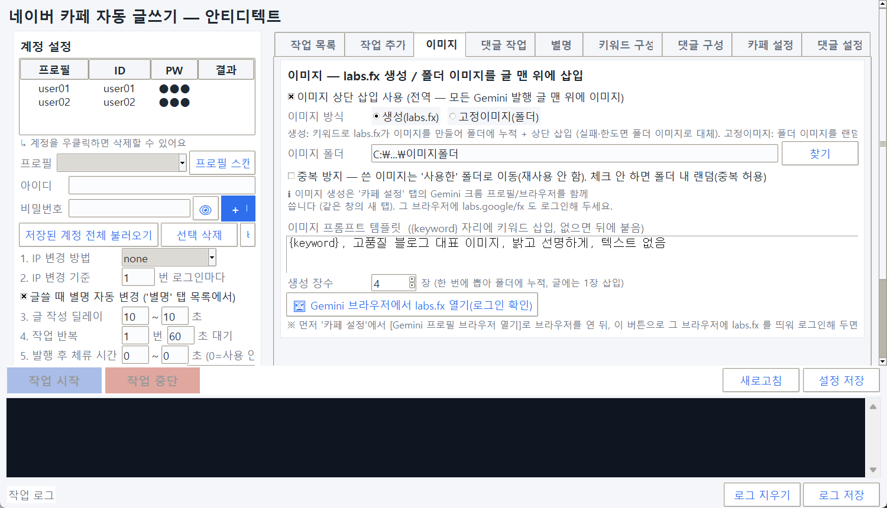
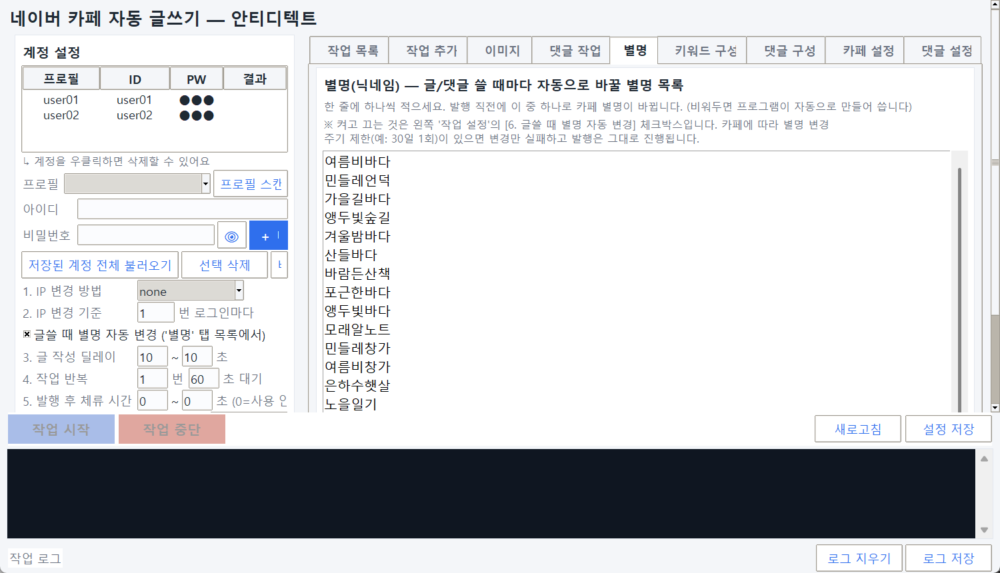
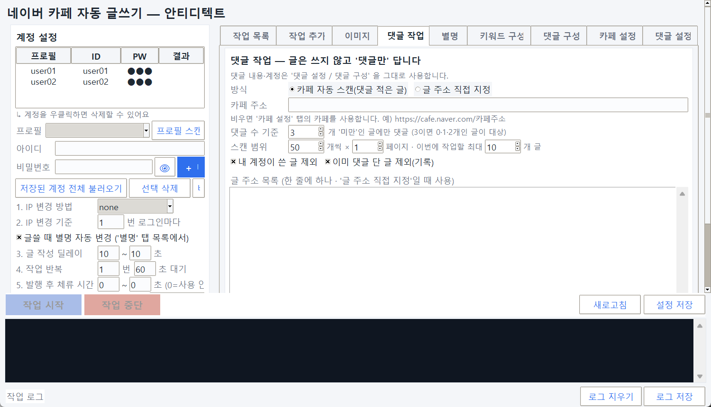
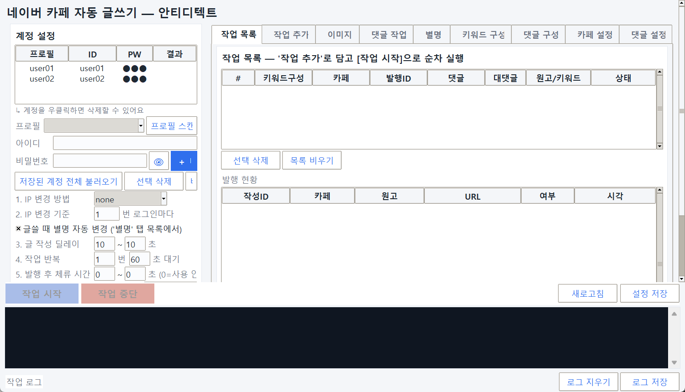

# 사용설명서

키워드 → Gemini(재미나이) 자동 글 생성 → 네이버 카페 자동 발행 (Gemini 워크플로)
목차 0. 로그인 1. 개요 2. 최초 준비(한 번만) 3. 카페 설정 4. 키워드 구성 5. 작업 추가 6. 이미지 7. 별명(자동 변경) 8. 댓글 작업 9. 작업 시작 · 예약 발행 10. 글 스타일(디자인) 11. 문제 해결 12. 배포(exe)

## 0. 로그인

▲ 로그인 팝업 —
아이디/비밀번호
입력 후
로그인
. ‘아이디 저장’ 체크 가능. 권한(navercafe_GPT) 있는 계정만 통과.
프로그램을 켜면 먼저 로그인 팝업이 뜹니다. 아이디/비밀번호를 넣고 로그인하면 메인 화면이 나타납니다.
- 서버 인증(같은 인증 서버)으로 확인하며, 이 프로그램 이용 권한(navercafe_GPT 카테고리)이 있는 계정만 통과합니다.
- 아이디 저장 체크 시 다음에 아이디가 자동 입력됩니다(비밀번호는 저장 안 함).
- 권한이 없으면 “이 계정은 카페 GPT 이용 권한이 없습니다” 안내가 뜹니다.

로그인은 프로그램 사용 권한 확인용입니다. (네이버/구글 로그인과는 별개 — 그건 발행/생성용으로 아래에서 따로 설정)

## 1. 개요

이 프로그램은 키워드만 넣으면 다음을 자동으로 합니다.
- 글 생성 — 구글 Gemini(gemini.google.com)에 프롬프트+키워드를 보내 HTML 블로그 글을 받아옵니다.
- 변환 — 받은 HTML의 제목·색·볼드·형광펜·표·색박스·목차·버튼을 네이버 카페 형식으로 바꿉니다.
- 발행 — 안티디텍트 브라우저로 로그인해 지정한 카페·게시판에 자동 등록합니다.

한 번의 작업 시작으로 선택한 계정들에 키워드를 하나씩 뽑아 순차 발행합니다.

## 2. 최초 준비 (한 번만)

| 항목 | 내용 |
|---|---|
| 크롬 설치 | Gemini 자동화에 Google Chrome 이 필요합니다. |
| Gemini 프로필 로그인 | 전용 크롬 프로필로 gemini.google.com 에 구글 로그인. (카페 설정 탭의 버튼으로 열어 로그인) |
| labs.fx 로그인(이미지 쓸 때) | Gemini 와 같은 크롬 프로필로 labs.google/fx 에 1회 로그인(권한 허용). '이미지' 탭 버튼으로 진행. |
| 프롬프트 파일 | 사용할 프롬프트1.txt — Gemini에 보낼 지침. 프로그램 폴더에 두면 자동 인식. |
| 안티디텍트 앱 + API 키 | 안티디텍트 앱 실행 + 설정에서 API 키(sk_…) 발급 → 카페 설정에 입력. |
| 네이버 로그인 | 각 안티디텍트 프로필에서 네이버에 1회 수동 로그인(로그인 유지 → 캡차 회피). |
| OpenAI 키(선택) | 네이버 로그인 캡차 자동해결용(있으면 편리). |

중요: 각 안티디텍트 프로필에 네이버가 로그인돼 있으면, 프로그램이 로그인·캡차를 건너뛰고 바로 발행합니다. 로그인이 풀려 있으면 네이버가 캡차를 띄워 실패할 수 있습니다.

## 3. 카페 설정 탭

▲ 왼쪽
계정 설정
(프로필·ID·PW 매칭표, ‘저장된 계정 전체 불러오기’, IP 변경/딜레이/반복/
예약 시작
/발행옵션) · 오른쪽
카페 설정
(
OpenAI 키·안티디텍트 키
,
카페 URL
추가,
게시판
) 과 그 아래
Gemini
(크롬 프로필 폴더·프롬프트 파일·모델·
Gemini 프로필 브라우저 열기
).

### 카페 · 게시판 · 키

- OpenAI 키 로그인 캡차 자동해결용(선택).
- 안티디텍트 키 안티디텍트 앱에서 발급한 sk_… 붙여넣기. 없으면 발행이 안 됩니다.
- 카페 URL 발행할 카페 주소를 추가. 여러 개 등록 가능(작업마다 다른 카페 선택 가능).
- 게시판 선택한 카페의 게시판이 자동으로 로딩됩니다.

### Gemini(재미나이) 설정

- 크롬 프로필 폴더 구글 로그인된 크롬 사용자 폴더. 예) C:\Users\나\chromeCookie\Profile gemini
- 프롬프트 파일 사용할 프롬프트1.txt 경로.
- 모델 flash(빠름) / pro(고품질).
- 🌐 프로필 브라우저 열기 눌러 그 창에서 구글 로그인 후 그대로 두면, [작업 시작] 때 재사용합니다. 로그인이 풀렸으면 안내 팝업이 뜹니다.

## 4. 키워드 구성 탭

▲
구성 이름
+
키워드(한 줄에 하나)
→
저장
. 아래 ‘저장된 구성’에서 고르고
불러오기
로 확인·수정,
삭제/전체 삭제
로 관리.
- 구성 이름을 입력합니다. (예: 여름_전기요금)
- 아래 칸에 키워드를 한 줄에 하나씩 적습니다.
- 저장 → 목록에 추가됩니다.

- 저장된 구성은 프로그램을 껐다 켜도 유지됩니다(keyword_compositions.json).
- 불러오기 / 삭제 / 전체 삭제 버튼으로 관리합니다.
- 여러 개 만들면 작업 추가의 키워드 구성 콤보에 모두 나타납니다.

발행 시 그 구성의 키워드를 하나씩 순서대로 뽑아 글을 만듭니다.
작업 수 > 키워드 수이면 순환합니다. 예) 작업 10개인데 키워드 3개면 1→2→3→1→2→3… 로 돌려 10개 모두 발행됩니다(주제 반복). 같은 키워드라도 Gemini가 매번 새로 생성하므로 글 내용은 매번 다릅니다. 주제 반복을 원치 않으면 키워드를 작업 수만큼 넣으세요.

## 5. 작업 추가 탭

▲
키워드 구성
선택 ·
카페/게시판
(기본=카페 설정값) · 지도/링크/표(선택) ·
발행 계정
(다중 선택) ·
사이클
(계정×사이클=작업 수) ·
댓글 구성
· 삽입 방식 →
＋ 작업 추가
. (발행 모드는 패킷 고정이라 선택칸 없음)
| 항목 | 설명 |
|---|---|
| 키워드 구성 | 사용할 키워드 묶음 선택. 🎲 랜덤(전체)이면 저장된 구성 중 무작위. |
| 카페 / 게시판 | (기본 설정 사용)이면 카페 설정의 값으로. 다른 카페를 고르면 그 작업만 해당 카페로 발행. |
| 발행 계정 | 여러 계정 선택 가능. 계정 × 사이클 = 작업 개수. |
| 사이클 | 선택 계정 전체를 이 횟수만큼 반복(각 계정당 글 수). |
| 댓글 구성 | 없음=댓글 안 함. 구성을 고르면 발행 후 자동 댓글/대댓글. |
| 삽입 방식 | 끝에 추가 / N개마다 끼워넣기. |

＋ 작업 추가를 누르면 작업 목록에 담깁니다.
발행 방식은 패킷 방식(antidetect+패킷)으로 고정이라 따로 고를 필요가 없습니다. 지도/링크/표 칸은 선택 입력이고, 본문은 Gemini가 만들므로 원고·이미지 폴더는 필요 없습니다. (‘글 구성’·‘완성형 폴더’ 기능은 Gemini 워크플로에선 안 씁니다.)

## 6. 이미지 탭 — 글 맨 위에 이미지 넣기

▲ 이미지 탭 — 방식(AI 생성/폴더) · 이미지 폴더 · 중복 방지 · 프롬프트 · 생성 장수
발행되는 모든 글의 맨 위(대표 이미지)에 이미지를 한 장 넣습니다. 켜고 끄는 것은 맨 위 체크박스 하나로 합니다.
| 항목 | 설명 |
|---|---|
| 이미지 상단 삽입 사용 | 전역 스위치. 체크하면 Gemini 로 발행하는 모든 글에 적용됩니다. |
| 생성(labs.fx) | 키워드로 구글 labs.fx(Flow) 가 이미지를 만들어 이미지 폴더에 누적 저장하고 그중 1장을 글 맨 위에 넣습니다. 생성 실패·로그인 풀림·한도면 폴더 이미지로 자동 대체합니다. |
| 고정이미지(폴더) | AI 생성 없이 폴더 안 이미지를 랜덤으로 사용합니다. |
| 이미지 폴더 | 생성 이미지가 쌓이는 곳이자, 폴더 모드에서 쓰는 이미지가 있는 곳입니다. |
| 중복 방지 | 체크하면 한 번 쓴 이미지를 폴더 안 ‘사용한’ 폴더로 이동해 다시 쓰지 않습니다. 체크 안 하면 폴더 안에서 랜덤(중복 허용). |
| 이미지 프롬프트 템플릿 | {keyword} 자리에 그 글의 키워드가 들어갑니다. (없으면 키워드가 뒤에 붙습니다) |
| 생성 장수 | 한 번에 뽑을 장수(최대 4장). 폴더에 모두 저장되고 글에는 1장만 들어갑니다. |

중요 — labs.fx 는 Gemini 와 같은 브라우저를 씁니다. 별도 프로필이 필요 없습니다. ‘카페 설정’의 Gemini 크롬 프로필 하나로 글(Gemini)과 이미지(labs.fx)를 모두 처리합니다(같은 창, 탭 1개 유지). 처음 한 번: ① ‘카페 설정’ → [🌐 Gemini 프로필 브라우저 열기] → gemini.google.com 로그인 → ② ‘이미지’ 탭 → [🖼 Gemini 브라우저에서 labs.fx 열기] → 열린 labs.fx 에서 “Create with Google Flow” → 구글 로그인 → 권한 허용까지 진행해 두면 이후 자동입니다.
AI 생성이 켜져 있는데 Gemini 브라우저가 안 열려 있으면 [작업 시작] 시 안내 팝업이 뜨고 진행되지 않습니다. 먼저 브라우저를 열어 두세요.

## 7. 별명 탭 — 글·댓글 쓸 때마다 별명 자동 변경

▲ 별명 탭 — 한 줄에 하나씩 별명 목록 · [저장] [예시 20개 채우기] [전체 삭제]
글을 쓰거나 댓글을 달기 직전에 카페 별명을 자동으로 바꿔 매번 다른 이름으로 보이게 합니다.
| 할 일 | 설명 |
|---|---|
| ① 켜기 | 왼쪽 '작업 설정'의 [글쓸 때 별명 자동 변경] 체크 (IP 변경 기준 바로 아래). 이 체크 하나로 글과 댓글 모두 적용됩니다. |
| ② 별명 목록 | 이 탭에 한 줄에 하나씩 적고 [저장]. 비워두면 프로그램이 자동으로 만들어 씁니다. [예시 20개 채우기]로 한 번에 채울 수 있습니다. |
| 규칙 | 한글·영문·숫자 2~20자. (목록에서 규칙에 안 맞는 줄은 자동 제외) |
| 어떻게 적용되나 | 글 쓸 때는 글쓴이 계정, 댓글 달 때는 그 댓글 계정의 별명이 각각 바뀝니다. 최근 쓴 별명은 되도록 다시 쓰지 않습니다. |

로그 예시 — [별명] user01 변경 → '민들레창가' · [발행] ✅ https://cafe.naver.com/…/00000 [별명] user02(댓글) 변경 → '은하수햇살' · [댓글] ✅ …
카페마다 별명 변경 제한이 있을 수 있습니다. 일부 카페는 "별명은 30일에 1회만 변경" 같은 제한이 있습니다. 그런 경우 별명 변경만 실패하고 글·댓글 작성은 그대로 진행됩니다(로그에 [별명] 변경 실패(그대로 진행)). 별명은 카페별로 설정되므로 다른 카페에는 영향이 없습니다.

## 8. 댓글 작업 — 글은 안 쓰고 댓글만 달기

▲ 댓글 작업 탭 — 카페 자동 스캔 / 글 주소 직접 지정
글은 발행하지 않고 다른 사람 글에 댓글만 답니다. 댓글 내용·계정은 ‘댓글 설정 / 댓글 구성’ 을 그대로 사용합니다.
| 방식 | 설명 |
|---|---|
| 카페 자동 스캔 | 카페 주소를 넣으면 최신글을 훑어 댓글 수가 기준 ‘미만’인 글에만 댓글을 답니다. |
| 글 주소 직접 지정 | 아래 칸에 글 링크를 한 줄에 하나씩 넣으면 그 글에만 댓글을 답니다. |

| 설정 | 설명 |
|---|---|
| 댓글 수 기준 | 3으로 두면 댓글이 0·1·2개인 글이 대상입니다(3개 이상은 건너뜀). |
| 스캔 범위 | 최신글을 몇 개씩 × 몇 페이지 볼지 · 이번에 작업할 최대 글 수. |
| 내 계정이 쓴 글 제외 | 내 계정들이 쓴 글에는 댓글을 달지 않습니다. |
| 이미 댓글 단 글 제외 | 프로그램이 댓글 단 글을 기록해 다시 달지 않습니다. |
| 🔍 대상 미리보기 | 댓글을 달지 않고 조건에 맞는 글이 몇 개인지 먼저 확인합니다. |
| + 댓글 작업 추가 | ‘작업 목록’에 담깁니다. [작업 시작] 을 눌러 실행하세요. |

별명 자동 변경을 켜두면 댓글마다 별명도 함께 바뀝니다. 로그 예시 — [댓글작업] 최신글 50개 스캔 → 댓글 3개 미만 대상 2개 · [댓글] ✅ …

## 9. 작업 시작 · 예약 발행

▲
작업 목록
(키워드구성·카페·계정·상태) 과
발행 현황
(작성ID·URL·성공여부). 성공 행 더블클릭=그 글로 이동. 예약은 왼쪽
예약 시작
체크+시각 지정 후 작업 시작.
- 왼쪽 설정(딜레이·반복·IP 등)을 확인합니다.
- 작업 시작을 누르면 순서대로: 키워드 뽑기 → Gemini 생성 → 카페 변환 → 로그인(유지 시 스킵) → 발행.
- 작업 목록의 상태(발행중/완료/실패)와 발행 현황(작성ID·URL)에서 결과를 확인합니다. 성공 행을 더블클릭하면 그 글로 이동합니다.

### 예약 발행 (스케줄)

- 왼쪽의 예약 시작을 체크하고 시각을 지정합니다(달력·시간 선택 → YYYY-MM-DD HH:MM).
- 이 상태에서 작업 시작을 누르면 그 시각까지 대기했다가 자동으로 생성·발행합니다(대기 중 남은 시간 표시).
- 지정 시각이 이미 지났으면 즉시 시작합니다. 예약 안 하면 바로 발행합니다.

연속 등록 제한: 네이버는 같은 계정으로 너무 빨리 연속 등록하면 막습니다. 글 사이 60~90초 간격(딜레이)을 두세요.

## 10. 글 스타일(디자인)

네이버 카페는 티스토리처럼 임의 HTML/CSS 를 못 쓰고 자체 편집기 형식을 씁니다. 지원 범위는 다음과 같습니다.
| 지원됨 | 미지원(자동 근사/제외) |
|---|---|
| 볼드·기울임·밑줄, 글자색, 형광펜, 제목 크기, 문단 정렬, 표(색 헤더), 링크, 색 배경 박스·목차 박스, 바로가기 버튼 | 둥근 테두리·그림자 등 CSS 레이아웃 → 색 배경까지만 근사. HTML 주석/코드라벨은 자동 제거. 이모지는 제목에 병합. |

- 제목 앞·박스/표 뒤·FAQ 질문 앞·목록 항목 사이에 자동 여백이 들어가 읽기 편합니다.
- 디자인 방향은 사용할 프롬프트1.txt 를 수정해 바꿀 수 있습니다(색 테마 등).

## 11. 문제 해결

| 증상 | 해결 |
|---|---|
| 프로그램 로그인 안 됨 | 아이디/비밀번호 확인. “권한 없음”이면 그 계정에 navercafe_GPT 이용권한이 필요합니다. |
| 발행이 안 됨 / 네이버 로그인 실패 | 안티디텍트 API 키 확인. 해당 프로필에 네이버 수동 로그인(캡차 회피). 실패 시 팝업으로 안내됩니다. |
| Gemini "로그인 필요" 팝업 | 카페 설정 → 프로필 브라우저 열기 → 구글 로그인 후 다시 시작. |
| Gemini가 글 대신 “주제를 알려주세요”로 되물음 | 프로그램이 자동 감지 → 키워드로 다시 요청/새 대화 재생성합니다(별도 조작 불필요). |
| "현재 채팅 지우고 새 채팅?" 확인창 | 프로그램이 자동으로 확인하고 진행합니다. |
| 재미나이 크롬이 안 뜸 | 같은 프로필을 쓰는 다른 크롬 창을 닫으세요. (프로필 손상 시 자동 복구.) |
| 별명이 안 바뀜 | ‘작업 설정’의 [글쓸 때 별명 자동 변경]이 켜져 있는지, ‘별명’ 탭 목록이 저장됐는지 확인하세요. 카페에 별명 변경 주기 제한(예: 30일 1회)이 있으면 변경만 실패하고 글·댓글은 그대로 올라갑니다. |
| 별명이 계속 같은 것만 나옴 | ‘별명’ 탭에 여러 개를 넣어주세요([예시 20개 채우기] 사용). 최근 쓴 별명은 되도록 피해서 뽑습니다. |
| 이미지가 안 들어감 / AI 생성 실패 | ‘이미지’ 탭에서 폴더 지정 확인. AI 생성은 Gemini 브라우저를 먼저 열고 labs.fx 로그인(권한 허용)이 돼 있어야 합니다. 실패 시 자동으로 폴더 이미지를 씁니다. |
| 같은 이미지가 반복됨 | ‘이미지’ 탭의 중복 방지를 체크하면 쓴 이미지를 ‘사용한’ 폴더로 옮겨 재사용하지 않습니다. |
| "게시판을 연속으로…" 오류 | 발행 간격(딜레이)을 60~90초로 늘리세요. |
| 이상한 문구/줄 붙음 | 자동 정리됩니다(HTML 주석 제거·문단/항목 간격·이모지 정리). |

## 12. 배포(exe) 참고

- 고객 PC 요건: 크롬 설치 + 그 크롬 프로필에 구글 로그인, 안티디텍트 프로필마다 네이버 1회 로그인.
- exe 와 함께 사용할 프롬프트1.txt 를 동봉합니다(프로그램이 폴더에서 자동 탐색).
- 첫 실행 시 크롬 드라이버를 자동 다운로드하므로 인터넷이 필요합니다.
- 배포 전 깨끗한 PC에서 1회 실행 검증을 권장합니다. (자세한 빌드 방법은 DISTRIBUTION.md)

© 네이버 카페 자동 발행기 · Gemini 워크플로 사용 설명서
